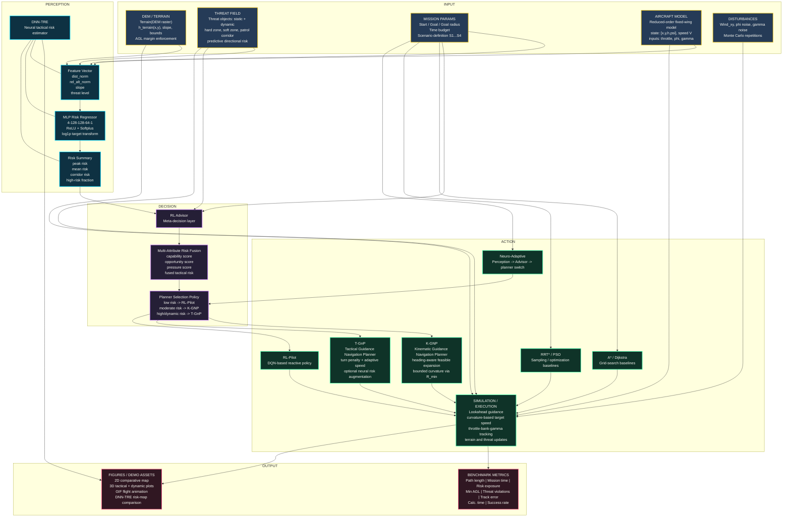

# Project Framework Integration

## Notes

- `DNN-TRE` is a standalone tactical risk estimation module and also a perception layer for the neuro-adaptive planner.
- `RL Advisor` does not directly fly the aircraft; it selects among planner modes.
- `K-GNP` and `T-GnP` are the core flyability-aware planning contributions.
- `Simulation` is the common execution layer used for fair comparison across all planners.
